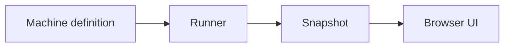
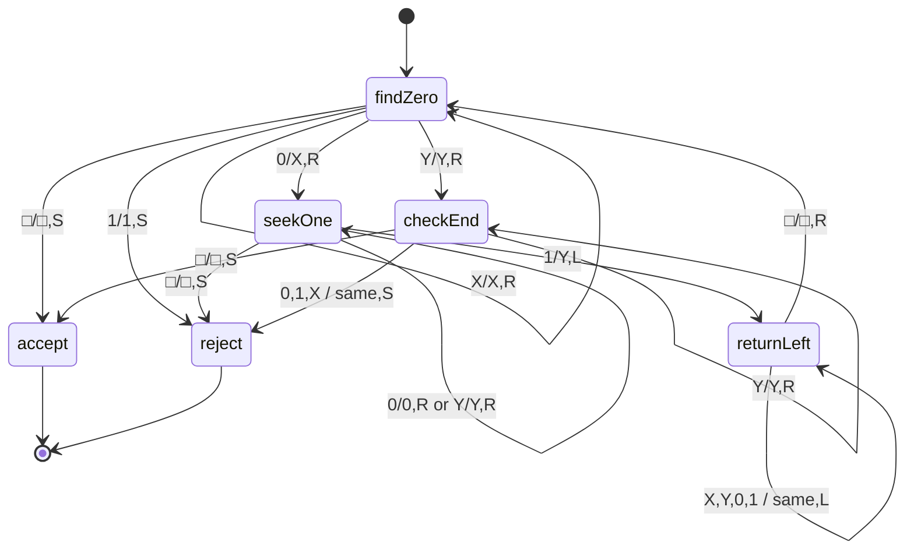

# Automata Lab

An interactive Theory of Computation simulator built with plain HTML, CSS, and JavaScript. Open `index.html` directly in a browser; there is no build step, framework, or runtime dependency.

## Features

- DFA and NFA execution, including epsilon closure and simultaneous active states.
- Validated Turing machines with a bidirectionally expanding tape, `L`/`R`/`S` moves, explicit reject states, implicit rejection for missing transitions, bounded runs, and trimmed transducer output.
- Nondeterministic PDAs with breadth-first configuration tracking, epsilon transitions, wildcard stack tops, push/pop operations, and final-state/empty-stack/either acceptance.
- Definition-driven state diagrams and transition tables, live state/edge highlighting, input validation, examples, execution trace, tape/stack views, and responsive layout.
- Dependency-free reference and consistency tests.

## Run And Test

Open `index.html` in a modern browser. Select a mode and machine, enter an input string, and use **Run**, **Step**, **Pause**, or **Reset**. `Ctrl+Enter` (or `⌘+Enter`) starts a run; `Esc` pauses it. Use **Try example** to cycle through a machine's configured examples.

Run the tests with Node.js 20 or newer:

```sh
node tests/verify.cjs
npm test
```

## Project Structure

- `index.html` — simulator structure and controls.
- `styles.css` — visual styling and responsive layout.
- `engines.js` — machine definitions, validation, and DOM-independent runners; exposes `window.AutomataEngines`.
- `app.js` — browser UI and pure helpers exposed as `window.AutomataUI` and CommonJS exports.
- `tests/verify.cjs` — runs all test modules.
- `tests/engines.test.cjs` — runner behavior and PDA reference comparisons.
- `tests/machines.test.cjs` — definition, example, and exhaustive language checks.
- `tests/ui.test.cjs` — pure diagram/table/input/speed tests and markup checks.
- `.github/workflows/test.yml` — Node 20 test workflow.
- `.github/workflows/pages.yml` — deploys the repository root to GitHub Pages.

Each engine runner returns `{ step, run, reset, snapshot }`. Existing snapshot fields are stable; the schemas below list all current fields.

## Snapshot Schemas

| Mode | Snapshot fields | Meaning |
| --- | --- | --- |
| DFA/NFA | `position`, `active`, `history`, `status`, `reading` | `active` is the set of states after epsilon closure. `reading` is the current symbol, or `∅` when no symbol remains. Each history entry has `index`, `state`, `symbol`, `transition`, `to`, and `edges` (the exact finite transition triples used). |
| TM | `tape`, `displayTape`, `head`, `headIndex`, `state`, `history`, `status`, `steps`, `reading`, `blank`, `reason`, `output` | The initial empty tape contains one blank. `head` and `headIndex` identify the head within `displayTape`. `output` trims leading and trailing blanks. Each history entry has `index`, `state`, `symbol`, `transition`, `to`, `write`, `move`, `headBefore`, and `headAfter`. |
| PDA | `position`, `state`, `stack`, `history`, `status`, `reading`, `branches`, `activeStates`, `acceptBy`, `reason` | `stack` is bottom-to-top with `Z₀` as its bottom marker. `state`/`stack`/`position` select the accepting branch when one exists, otherwise the first live branch. `activeStates` lists states in the live frontier. `reading` is `ε` only for empty input and `end` after nonempty input is consumed. Each history entry has `index`, `state`, `symbol`, `transition`, `to`, `stackTop`, `positionBefore`, and `positionAfter`. |

For all modes, `status` is `ready`, `running`, `accepted`, `rejected`, or `halted`. TM `reason` is `no transition for (state, symbol)` on implicit rejection or `step limit exceeded` on a bounded run; PDA `reason` is `configuration limit exceeded` if its safety cap is reached. Otherwise `reason` is `null`.

## Machine Formats

### Finite Automata

Finite definitions have `id`, `name`, `kind`, `description`, `alphabet`, `states`, `start`, `accepts`, `example`, and `transitions`. A DFA maps each state/symbol pair to one destination and must be total. An NFA can map to a destination array. The `ε` key changes state without consuming input.

### Turing Machines

A TM definition has `states`, `start`, `accepts`, optional `rejects`, `alphabet`, `tapeAlphabet`, optional `blank` (default `□`), and `transitions`. A transition is `{ write, move, next }`; `move` is `L`, `R`, or `S`. Every read and written symbol, including the blank, must be in `tapeAlphabet`; every input symbol must be in `alphabet`. A missing transition rejects with a reason. `run(maxSteps = 10000)` halts with `step limit exceeded` if no terminal state is reached within the bound.

### Pushdown Automata

A PDA definition has `states`, `start`, `accepts`, `alphabet`, `transitions`, and `acceptBy` (`finalState`, `emptyStack`, or `either`; default `either`). Transitions are keyed as `transitions[state][inputSymbolOrε][stackTopOrAny]`. `any` matches the current top symbol. A rule may be `{ push, next }`, `{ pop: true, next }`, or `{ next }` for no stack change. A string push adds one stack symbol; an array is pushed in order, so its last item becomes the new top. A value may be an array of rules to express nondeterminism. `Z₀` is the initial bottom marker; empty-stack acceptance means only `Z₀` remains. Acceptance is checked only after all input has been consumed. Exploration is capped at 5000 distinct configurations.

## Machine Library

| Type | Machine | Accepted example | Rejected example or output |
| --- | --- | --- | --- |
| DFA | Ends with `01` | `1101` | `1110` rejects |
| DFA | Even number of `1`s | `1010` | `111` rejects |
| NFA | Contains `010` | `11010` | `1111` rejects |
| ε-NFA | Ends in `0` or `1` | `101` | `ε` rejects |
| TM decider | `0ⁿ1ⁿ` | `0011` | `0101` rejects |
| TM decider | Binary palindrome | `0110` | `01100` rejects |
| TM decider | Equal counts of `0` and `1` | `0101` | `0001` rejects |
| TM transducer | Unary increment | `111` → `1111` | `1` → `11` |
| TM transducer | Binary increment | `1011` → `1100` | `1111` → `10000` |
| PDA | Balanced parentheses | `(()())` | `(()` rejects |
| PDA | `aⁿbⁿ` | `aaabbb` | `aabbb` rejects |
| PDA | Even palindrome `wwᴿ` | `abba` | `aba` rejects |
| PDA | Equal counts of `a` and `b` | `abba` | `aab` rejects |

Binary increment emits the canonical representation without leading zeroes, so `00` produces `1`.

## Data Flow



## `0ⁿ1ⁿ` State Diagram



Missing transitions also reject, as in the runner contract.

## Design Decisions

- **Step limits:** The halting problem means no general algorithm can determine whether an arbitrary Turing machine will halt. A finite transition limit keeps interactive runs responsive and distinguishes an unproven run from acceptance or rejection.
- **PDA configuration sets:** A nondeterministic PDA can make several choices from the same state/input/stack. The runner therefore explores a breadth-first set of configurations; selecting one path could incorrectly reject an input accepted by another path.
